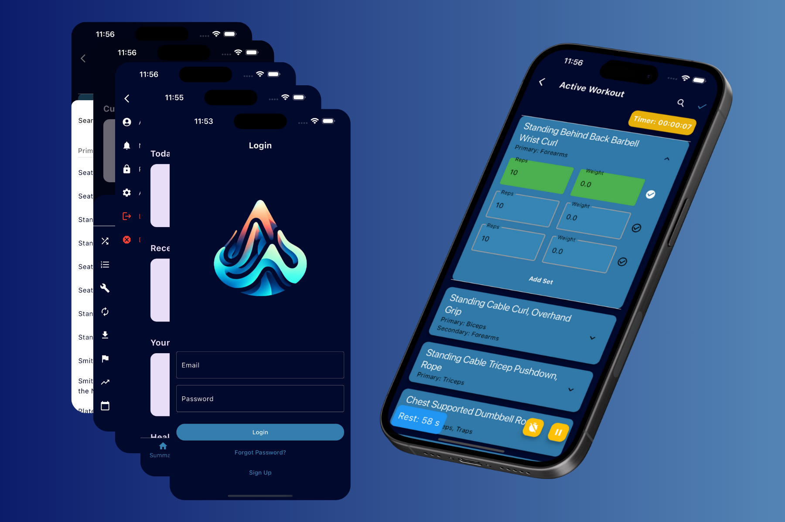

# Peak - Fitness Tracking App for Professionals



Peak is a comprehensive fitness tracking app tailored for fitness professionals. It offers robust tools for tracking workouts, meals, and various health metrics. With its intuitive dashboards, Peak empowers users to analyze and visualize their fitness journey effectively.

## Features

- **Workout Tracking:** Log every exercise with ease. Supports a wide range of activities and custom routines.
- **Nutrition Logging:** Keep track of your dietary habits with a detailed food logging system.
- **Metrics Dashboard:** Visualize your progress with customizable dashboards showing key fitness metrics.
- **Exercise Database:** A vast library of exercises, catering to all types of fitness routines.

[//]: # (TODO: Add screenshots of the app)

[//]: # (## Screenshots)

[//]: # ()

[//]: # (&#40;Place your app screenshots here&#41;)

## Getting Started

To get a local copy up and running, follow these simple steps.

### Prerequisites

Ensure you have Flutter installed on your system. If not, follow the [Flutter Installation Guide](https://flutter.dev/docs/get-started/install).

### Installation

1. Clone the repository:
   ```sh
   git clone https://github.com/grantrisk/peak.git
   ```
2. Navigate to the project directory:
   ```sh
    cd Peak
    ```
3. Install dependencies:
    ```sh
   flutter pub get
   ```
4. Run the app:
    ```sh
    flutter run
    ```